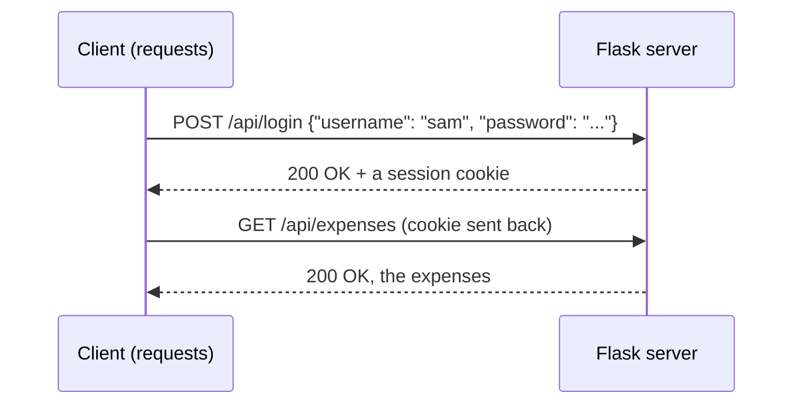

# Creating an API Lab

## Objectives
1. Design an Flask API for your PostgreSQL database
2. Write effective documentation using Markdown

## Your Task

In this lab, you will create a Flask API as an interface for your database. Refer to the [Flask Notes](#Software-Engineering/Flask-Notes). 

Using the SQL queries you wrote in the [Database Implementation Lab](#Software-Engineering/Database-Implementation-Lab), create an API that executes each query and returns the results as a JSON. You need API calls for **all of your use cases**. In the section below, we will talk about how to make sure only authorized users are able to send certain calls. You may also want to create certain API calls that are useful for the debugging process.

Using the `requests` library, make sure that you are getting the appropriate responses for your API. 

## Using `Flask-Login` for Credentialing

To protect certain calls to different types of users, we will use [Flask-Login](https://flask-login.readthedocs.io/en/latest/).

Flask-Login does one job: it remembers **who is logged in** between requests. It does not store your users, check passwords, or decide who is allowed to do what. You write those parts yourself, using the database you already have.



When a user logs in, Flask sends back a **session cookie**: a small signed piece of text holding that user's id. The client sends the cookie back with every later request, and Flask-Login uses it to look up the user.

The examples below add logins to the expense database from the [Database Implementation Lab](#Software-Engineering/Database-Implementation-Lab). It has two types of users: a `viewer` who can read expenses, and an `admin` who can also add categories. Swap in your own tables and user types.

### Step 1: Install Flask-Login

Run the following inside your virtual environment.

```text
pip install flask-login
```

### Step 2: Add a table of users

Add a table to your `sql/setup.sql` to hold the people who can log in.

```sql
CREATE TABLE app_user (
    user_id        INTEGER GENERATED ALWAYS AS IDENTITY PRIMARY KEY,
    username       TEXT NOT NULL UNIQUE,
    password_hash  TEXT NOT NULL,
    role           TEXT NOT NULL CHECK (role IN ('viewer', 'admin'))
);
```

- `user` is a reserved word in PostgreSQL, so name the table something else, like `app_user`.
- These are the users of **your application**. They are not the same thing as the PostgreSQL role (`project_user`) that your code uses to connect to the database.
- **Never store the actual password.** Store a **hash**, a scrambled version that cannot be turned back into the password. If someone steals your database, they still don't have anyone's password.

Flask already comes with a function that makes the hash. Use it in a small script, `add_user.py`, to create your users:

```python
import os
import sys

import psycopg
from dotenv import load_dotenv
from werkzeug.security import generate_password_hash

load_dotenv()
conn_str = os.environ["DATABASE_URL"]

username, password, role = sys.argv[1], sys.argv[2], sys.argv[3]

with psycopg.connect(conn_str) as conn:
    with conn.cursor() as cur:
        cur.execute(
            "INSERT INTO app_user (username, password_hash, role) VALUES (%s, %s, %s)",
            (username, generate_password_hash(password), role),
        )

print(f"Added {role} {username}")
```

```text
python add_user.py sam sams_password viewer
python add_user.py ms_g admin_password admin
```

### Step 3: Set up Flask-Login in your app

Add the following near the top of your `app.py`.

```python
import os

import psycopg
from dotenv import load_dotenv
from flask import Flask, request
from flask_login import (LoginManager, UserMixin, current_user,
                         login_required, login_user, logout_user)
from werkzeug.security import check_password_hash

load_dotenv()
conn_str = os.environ["DATABASE_URL"]

app = Flask(__name__)
app.secret_key = os.environ["SECRET_KEY"]

login_manager = LoginManager()
login_manager.init_app(app)


class User(UserMixin):
    def __init__(self, user_id, username, role):
        self.id = user_id
        self.username = username
        self.role = role


@login_manager.user_loader
def load_user(user_id):
    with psycopg.connect(conn_str) as conn:
        with conn.cursor() as cur:
            cur.execute(
                "SELECT user_id, username, role FROM app_user WHERE user_id = %s",
                (int(user_id),),
            )
            row = cur.fetchone()
    if row is None:
        return None
    return User(row[0], row[1], row[2])


@login_manager.unauthorized_handler
def unauthorized():
    return {"error": "You must log in first"}, 401
```

| Piece | Meaning |
| --- | --- |
| `app.secret_key` | Flask uses this to sign the session cookie so a client cannot edit it and pretend to be someone else |
| `LoginManager()` | The object that connects Flask-Login to your app |
| `class User(UserMixin)` | Represents one logged-in user. `UserMixin` supplies the methods Flask-Login needs, as long as your class has an `id` attribute |
| `@login_manager.user_loader` | Flask-Login calls this on every request with the id from the cookie. Return the matching `User`, or `None` if they no longer exist |
| `@login_manager.unauthorized_handler` | What to send back when someone who is not logged in calls a protected route. Without it, the client gets an HTML error page instead of JSON |

The secret key is a password for your server, so it goes in your `.env` file next to `DATABASE_URL`, not in your code. Generate a random one with:

```text
python -c "import secrets; print(secrets.token_hex(32))"
```

```text
SECRET_KEY=paste_the_long_random_string_here
```

### Step 4: Add login and logout routes

```python
@app.route("/api/login", methods=["POST"])
def login():
    data = request.get_json()
    if not data or "username" not in data or "password" not in data:
        return {"error": "username and password are required"}, 400

    with psycopg.connect(conn_str) as conn:
        with conn.cursor() as cur:
            cur.execute(
                "SELECT user_id, username, role, password_hash FROM app_user WHERE username = %s",
                (data["username"],),
            )
            row = cur.fetchone()

    if row is None or not check_password_hash(row[3], data["password"]):
        return {"error": "Wrong username or password"}, 401

    login_user(User(row[0], row[1], row[2]))
    return {"message": f"Logged in as {row[1]}", "role": row[2]}


@app.route("/api/logout", methods=["POST"])
@login_required
def logout():
    logout_user()
    return {"message": "Logged out"}
```

- `check_password_hash` hashes the password the client sent and compares it to the stored hash.
- `login_user(...)` is the line that actually logs the user in. It puts their id in the session cookie.
- The error is the same whether the username or the password was wrong. Don't tell an attacker which usernames exist.

### Step 5: Protect your routes

There are three levels of protection. Decide which one each of your use cases needs.

**Anyone can call it.** Do nothing.

```python
@app.route("/api/categories", methods=["GET"])
def list_categories():
    with psycopg.connect(conn_str) as conn:
        with conn.cursor() as cur:
            cur.execute("SELECT category_id, name FROM category ORDER BY name")
            rows = cur.fetchall()
    return [{"category_id": r[0], "name": r[1]} for r in rows]
```

**Any logged-in user can call it.** Add `@login_required` **below** `@app.route`.

```python
@app.route("/api/expenses", methods=["GET"])
@login_required
def list_expenses():
    with psycopg.connect(conn_str) as conn:
        with conn.cursor() as cur:
            cur.execute("SELECT expense_id, amount, note FROM expense ORDER BY expense_id")
            rows = cur.fetchall()
    return [{"expense_id": r[0], "amount": float(r[1]), "note": r[2]} for r in rows]
```

**Only one type of user can call it.** Add `@login_required`, then check `current_user`, which is the `User` object for whoever sent the request.

```python
@app.route("/api/categories", methods=["POST"])
@login_required
def add_category():
    if current_user.role != "admin":
        return {"error": "Only admins can add categories"}, 403

    data = request.get_json()
    if not data or "name" not in data:
        return {"error": "name is required"}, 400

    with psycopg.connect(conn_str) as conn:
        with conn.cursor() as cur:
            cur.execute("INSERT INTO category (name) VALUES (%s)", (data["name"],))
    return {"message": f"Added category {data['name']}"}, 201
```

You can also use `current_user` in your queries, for example `WHERE user_id = %s` with `(current_user.id,)` so that users only see their own rows.

| Status code | When to use it |
| --- | --- |
| `401 Unauthorized` | We don't know who you are. Log in first |
| `403 Forbidden` | We know who you are, and you are not allowed to do this |

### Step 6: Test it

A plain `requests.get(...)` throws the cookie away after each call, so you would be logged out immediately. Use a `requests.Session()`, which remembers cookies the way a browser does.

```python
import requests

BASE = "http://127.0.0.1:5000/api"

# Not logged in
print(requests.get(f"{BASE}/categories").status_code)   # 200, anyone can see this
r = requests.get(f"{BASE}/expenses")
print(r.status_code, r.json())                          # 401 {'error': 'You must log in first'}

# Log in as a viewer. The Session remembers the cookie.
viewer = requests.Session()
r = viewer.post(f"{BASE}/login", json={"username": "sam", "password": "sams_password"})
print(r.status_code, r.json())                          # 200 {'message': 'Logged in as sam', 'role': 'viewer'}
print(viewer.get(f"{BASE}/expenses").status_code)       # 200
r = viewer.post(f"{BASE}/categories", json={"name": "Travel"})
print(r.status_code, r.json())                          # 403 {'error': 'Only admins can add categories'}

# Log in as an admin
admin = requests.Session()
admin.post(f"{BASE}/login", json={"username": "ms_g", "password": "admin_password"})
r = admin.post(f"{BASE}/categories", json={"name": "Travel"})
print(r.status_code, r.json())                          # 201 {'message': 'Added category Travel'}

# Log out
print(viewer.post(f"{BASE}/logout").json())             # {'message': 'Logged out'}
print(viewer.get(f"{BASE}/expenses").status_code)       # 401
```

Test every protected route three ways: not logged in, logged in as a user who **should** be allowed, and logged in as a user who should **not** be.

### Common errors

| Error | Fix |
| --- | --- |
| `RuntimeError: The session is unavailable because no secret key was set` | You did not set `app.secret_key`, or `SECRET_KEY` is missing from your `.env` |
| `Exception: Missing user_loader or request_loader` | You forgot the `@login_manager.user_loader` function |
| Login works, but the next request returns `401` | You are using `requests.get` instead of a `requests.Session()` |
| Everyone is logged out whenever the server restarts | Your secret key changes each run. Save one in `.env` instead of generating it in your code |
| A protected route can be called without logging in | `@login_required` is above `@app.route`. It must go below |
| The `401` response is an HTML page | You forgot the `@login_manager.unauthorized_handler` function |

### Quick reference

| I want to... | Code |
| --- | --- |
| Hash a password before saving it | `generate_password_hash(password)` |
| Check a password at login | `check_password_hash(stored_hash, password)` |
| Log a user in | `login_user(user)` |
| Log a user out | `logout_user()` |
| Require a login for a route | `@login_required` below `@app.route` |
| Find out who sent the request | `current_user.id`, `current_user.role` |
| Limit a route to one type of user | `if current_user.role != "admin": return {...}, 403` |


## Documentation

We will create a `github.io` site to host the documentation for your program. This site needs three sections. Use [this repo]() as a template for your site.

As part of a README for your project, you will also add documentation from your API.

Use the examples below as inspiration for your documentation