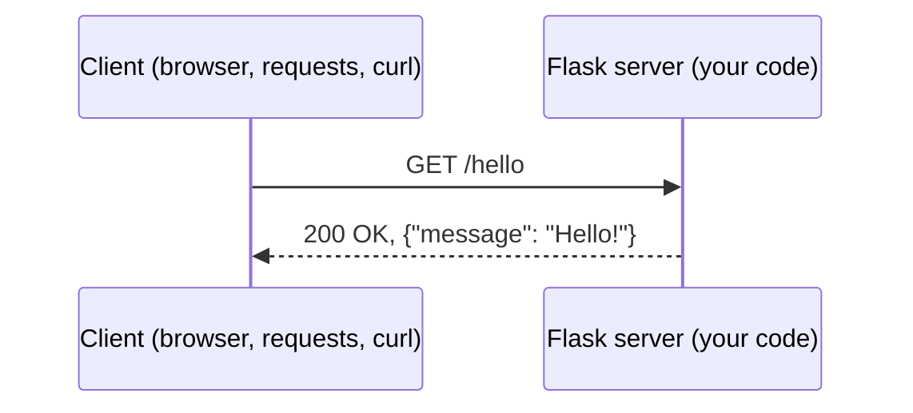

# Flask Notes

## What is Flask?

[Flask](https://flask.palletsprojects.com/) is a lightweight Python library for building web servers. In the [Requests and Using APIs Lab](#Software-Engineering/Requests-and-Using-APIs-Lab) you were the **client** sending requests. With Flask, you write the **server** that receives requests and sends back responses.




## Install Flask 

Run the following inside your virtual environment.

```text
pip install flask
```

## Hello World

```python
from flask import Flask

app = Flask(__name__)


@app.route("/")
def home():
    return "Hello, World!"


if __name__ == "__main__":
    app.run(debug=True)
```

Run the file with `python app.py` and open `http://127.0.0.1:5000/` in your browser.

| Piece | Meaning |
| --- | --- |
| `app = Flask(__name__)` | Creates your web application |
| `@app.route("/")` | A **decorator** that connects a URL path to the function below it |
| `def home():` | The **view function**. Whatever it returns is sent back as the response |
| `app.run(debug=True)` | Starts the server on port 5000. `debug=True` restarts the server when you save and shows helpful error pages |

**Note:** `127.0.0.1` (also called `localhost`) means "this computer." Only you can reach the server while it runs this way.

## Returning JSON

An API usually returns JSON instead of text or HTML. If a view function returns a dictionary or list, Flask converts it to JSON for you.

```python
@app.route("/api/pokemon")
def get_pokemon():
    return {"name": "Ivysaur", "types": ["grass", "poison"], "height": 10}
```

Response:
```json
{"height": 10, "name": "Ivysaur", "types": ["grass", "poison"]}
```

You can also use `jsonify`, which works for any JSON-friendly value:
```python
from flask import jsonify

@app.route("/api/numbers")
def numbers():
    return jsonify([1, 2, 3])
```

## Route parameters

Put a variable in `< >` in the path to capture part of the URL. Add a **converter** like `int:` to change its type.

```python
pokedex = {
    1: {"name": "Bulbasaur", "types": ["grass", "poison"]},
    2: {"name": "Ivysaur", "types": ["grass", "poison"]},
    4: {"name": "Charmander", "types": ["fire"]},
}


@app.route("/api/pokemon/<int:number>")
def get_pokemon(number):
    if number not in pokedex:
        return {"error": "Pokemon not found"}, 404
    return pokedex[number]
```

| Request | Response |
| --- | --- |
| `GET /api/pokemon/2` | `200` `{"name": "Ivysaur", "types": ["grass", "poison"]}` |
| `GET /api/pokemon/99` | `404` `{"error": "Pokemon not found"}` |

**Returning a status code:** return a tuple of `(body, status_code)`. If you leave it off, Flask uses `200 OK`.

## Query parameters

Query parameters come after the `?` in the URL. Read them with `request.args`.

```python
from flask import request

@app.route("/api/greet")
def greet():
    name = request.args.get("name", "stranger")   # default if missing
    times = request.args.get("times", 1, type=int)
    return {"message": f"Hello, {name}! " * times}
```

`GET /api/greet?name=Sam&times=2` returns:
```json
{"message": "Hello, Sam! Hello, Sam! "}
```

## Handling POST requests

By default a route only accepts `GET`. Use `methods=` to accept other methods, and `request.get_json()` to read a JSON body.

```python
@app.route("/api/pokemon", methods=["POST"])
def add_pokemon():
    data = request.get_json()

    if not data or "number" not in data or "name" not in data:
        return {"error": "number and name are required"}, 400

    pokedex[data["number"]] = {"name": data["name"], "types": data.get("types", [])}
    return pokedex[data["number"]], 201
```

| Status code | When to use it |
| --- | --- |
| `200 OK` | The request worked |
| `201 Created` | A POST successfully created something new |
| `400 Bad Request` | The client sent missing or invalid data |
| `404 Not Found` | The thing the client asked for doesn't exist |
| `500 Internal Server Error` | Your server code crashed (Flask sends this automatically) |

## Putting it together: a To-Do API

This small API lets a client list, view, add, and delete to-do items. The data lives in a Python list, so it resets when the server restarts. Later we will store data in a database instead.

```python
from flask import Flask, request

app = Flask(__name__)

todos = [
    {"id": 1, "task": "Finish Flask notes", "done": False},
    {"id": 2, "task": "Push to GitHub", "done": True},
]
next_id = 3


def find_todo(todo_id):
    for todo in todos:
        if todo["id"] == todo_id:
            return todo
    return None


@app.route("/api/todos", methods=["GET"])
def list_todos():
    return todos


@app.route("/api/todos/<int:todo_id>", methods=["GET"])
def get_todo(todo_id):
    todo = find_todo(todo_id)
    if todo is None:
        return {"error": "To-do not found"}, 404
    return todo


@app.route("/api/todos", methods=["POST"])
def add_todo():
    global next_id
    data = request.get_json()
    if not data or "task" not in data:
        return {"error": "task is required"}, 400

    todo = {"id": next_id, "task": data["task"], "done": False}
    todos.append(todo)
    next_id += 1
    return todo, 201


@app.route("/api/todos/<int:todo_id>", methods=["DELETE"])
def delete_todo(todo_id):
    todo = find_todo(todo_id)
    if todo is None:
        return {"error": "To-do not found"}, 404
    todos.remove(todo)
    return {"message": f"Deleted to-do {todo_id}"}


if __name__ == "__main__":
    app.run(debug=True)
```

| Method | Path | What it does |
| --- | --- | --- |
| `GET` | `/api/todos` | List every to-do |
| `GET` | `/api/todos/<id>` | Get one to-do |
| `POST` | `/api/todos` | Add a to-do (send `{"task": "..."}`) |
| `DELETE` | `/api/todos/<id>` | Delete a to-do |

## Testing your API

Your browser can only easily send `GET` requests. To test other methods, use a second Python file with `requests` while the server is running in another terminal.

```python
import requests

BASE = "http://127.0.0.1:5000/api/todos"

# GET all
print(requests.get(BASE).json())

# POST a new to-do
response = requests.post(BASE, json={"task": "Study for quiz"})
print(response.status_code, response.json())    # 201 {'done': False, 'id': 3, 'task': 'Study for quiz'}

# GET one that doesn't exist
response = requests.get(f"{BASE}/99")
print(response.status_code, response.json())    # 404 {'error': 'To-do not found'}

# DELETE
print(requests.delete(f"{BASE}/1").json())      # {'message': 'Deleted to-do 1'}
```

**Note:** `json=` automatically converts the dictionary to JSON and sets the `Content-Type: application/json` header, which `request.get_json()` needs.

You can also test from the terminal with `curl`:
```text
curl http://127.0.0.1:5000/api/todos
curl -X POST -H "Content-Type: application/json" -d '{"task": "Study"}' http://127.0.0.1:5000/api/todos
curl -X DELETE http://127.0.0.1:5000/api/todos/1
```

## Quick reference

| I want to... | Code |
| --- | --- |
| Create a route | `@app.route("/path")` |
| Accept other methods | `@app.route("/path", methods=["GET", "POST"])` |
| Capture part of the URL | `@app.route("/items/<int:item_id>")` |
| Read a query parameter | `request.args.get("key", default)` |
| Read a JSON body | `request.get_json()` |
| Return JSON | `return {"key": "value"}` or `return jsonify(data)` |
| Return a status code | `return {"error": "..."}, 404` |
