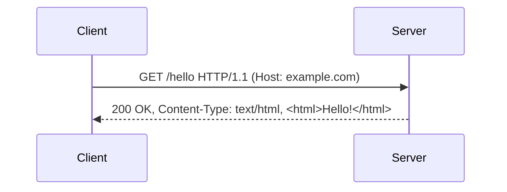

# HTTP and HTTPS Notes

## Client/server review

TCP and UDP are transport protocols (how data is delivered). HTTP sits above them at the application layer (what is being said) and typically runs over TCP. 
- Client: browser, phone app, script. 
- Server: the machine that answers.

## Components of a URL

Let's look at the following URL
```text
https://www.example.com:443/products/shoes?color=red&size=10
```

We can break it down into these components:
| Part | Meaning | Example |
| --- | --- | --- |
| Protocol (scheme) | How to talk | `https` |
| Domain | Which server (DNS resolves it to an IP) | `www.example.com` |
| Port (optional) | Which door; defaults to 80 (http) / 443 (https) | `:443` |
| Path | Which resource on the server | `/products/shoes` |
| Query string | Extra `key=value` params after `?`, joined by `&` | `?color=red&size=10` |

## HTTP request and response

HTTP is request-response: the client sends one request, the server sends exactly one response back.



**Request anatomy:**
```text
POST /login HTTP/1.1                (method, path, version)
Host: example.com                   (headers)
Content-Type: application/json

{"user": "sam", "password": "..."}  (body, optional)
```

**Response anatomy:**
```text
HTTP/1.1 200 OK                     (version, status code, reason)
Content-Type: application/json      (headers)
Content-Length: 27

{"message": "Welcome, sam!"}        (body)
```

**HTTPS = HTTP + TLS encryption.** Same messages, but encrypted in transit (so someone running Wireshark on the same Wi-Fi can't read them) and the server's identity is verified with a certificate.

### HTTP methods

| Method | Purpose | Typical use | Has body? |
| --- | --- | --- | --- |
| `GET` | Read data | Load a page, fetch a user | No |
| `POST` | Create data / submit | Sign up, submit a form | Yes |
| `PUT` | Replace a resource entirely | Overwrite a profile | Yes |
| `PATCH` | Partially update a resource | Change just the email | Yes |
| `DELETE` | Remove a resource | Delete a post | Usually no |

**Example — a "users" API:**
```text
GET    /users          -> list all users
GET    /users/42       -> get user 42
POST   /users          -> create a new user
PUT    /users/42       -> replace user 42 with the body's data
PATCH  /users/42       -> update only some fields of user 42
DELETE /users/42       -> delete user 42
```

### HTTP status codes

The first digit tells you the category — 2xx = "all good," 4xx = "your fault," 5xx = "our fault."

| Range | Meaning | Common codes |
| --- | --- | --- |
| 1xx | Informational | `100 Continue` |
| 2xx | Success | `200 OK`, `201 Created`, `204 No Content` |
| 3xx | Redirection | `301 Moved Permanently`, `302 Found`, `304 Not Modified` |
| 4xx | Client error | `400 Bad Request`, `401 Unauthorized`, `403 Forbidden`, `404 Not Found`, `429 Too Many Requests` |
| 5xx | Server error | `500 Internal Server Error`, `502 Bad Gateway`, `503 Service Unavailable` |

```text
GET /users/9999   -> 404 Not Found     (that user doesn't exist)
GET /admin        -> 403 Forbidden     (you're not allowed)
GET /users        -> 200 OK            (here they are)
GET /users        -> 500 Server Error  (server crashed)
```

## `requests` with Python: simple example

Install once: `pip install requests`

```python
import requests

response = requests.get("https://example.com")

print(response.status_code)              # 200
print(response.headers["Content-Type"])  # text/html; charset=UTF-8
print(response.text[:100])               # first 100 characters of the HTML
```

Checking the status code:
```python
if response.status_code == 200:
    print("Success!")
elif response.status_code == 404:
    print("Page not found")
else:
    print("Something else happened:", response.status_code)
```

Or let `requests` raise an exception for 4xx/5xx: `response.raise_for_status()`.

## JSON formats

JSON (JavaScript Object Notation) is the standard text format for structured data between programs.

| JSON type | Example | Python equivalent |
| --- | --- | --- |
| Object | `{"name": "Ada"}` | `dict` |
| Array | `[1, 2, 3]` | `list` |
| String | `"hello"` | `str` |
| Number | `42`, `3.14` | `int`, `float` |
| Boolean | `true`, `false` | `True`, `False` |
| Null | `null` | `None` |

**Example:**
```json
{
  "id": 42,
  "name": "Ada Lovelace",
  "active": true,
  "email": null,
  "languages": ["English", "French"],
  "address": { "city": "London", "country": "UK" }
}
```

**Using JSON in Python:**
```python
import json

data = json.loads('{"name": "Ada", "age": 36}')  # string -> dict
print(data["name"])                                # Ada

back_to_text = json.dumps(data)                    # dict -> string
```

Rules to remember: keys in double quotes, no trailing commas, no comments.

## `requests` with Python: more complex example

Using the free practice API [JSONPlaceholder](https://jsonplaceholder.typicode.com):

```python
import requests

url = "https://jsonplaceholder.typicode.com/users/1"
response = requests.get(url)
response.raise_for_status()

user = response.json()             # parses the JSON body into a dict
print(user["name"])                # Leanne Graham
print(user["address"]["city"])     # nested access
```

**Query string parameters** — pass `params` instead of building the URL by hand:
```python
response = requests.get(
    "https://jsonplaceholder.typicode.com/posts",
    params={"userId": 1}
)
# Actual URL requested: .../posts?userId=1

posts = response.json()            # a list of dicts
for post in posts[:3]:
    print("-", post["title"])
```

**Handling errors:**
```python
try:
    r = requests.get("https://jsonplaceholder.typicode.com/users/9999", timeout=5)
    r.raise_for_status()
    print(r.json())
except requests.exceptions.HTTPError as e:
    print("HTTP error:", e)              # 404 Not Found
except requests.exceptions.Timeout:
    print("Server took too long")
except requests.exceptions.ConnectionError:
    print("Could not connect")
```

**POST: sending JSON:**
```python
new_post = {"title": "My first post", "body": "Hello, world!", "userId": 1}

r = requests.post(
    "https://jsonplaceholder.typicode.com/posts",
    json=new_post          # automatically encodes as JSON + sets the header
)
print(r.status_code)       # 201 Created
print(r.json())            # the created object, with a new "id"
```
