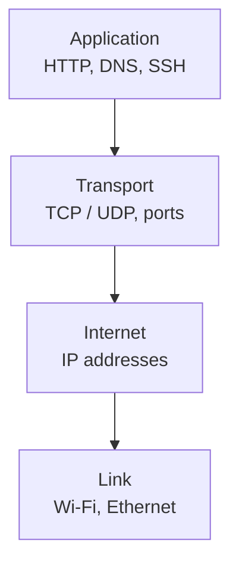
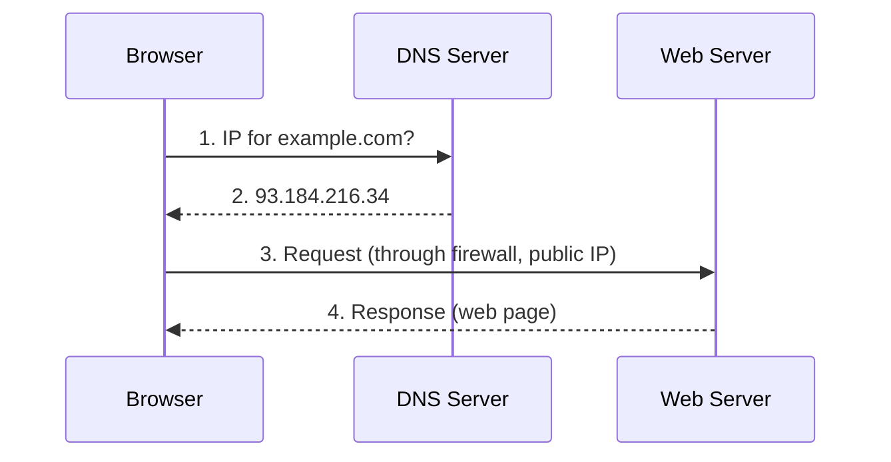
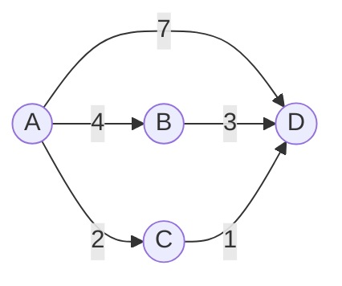
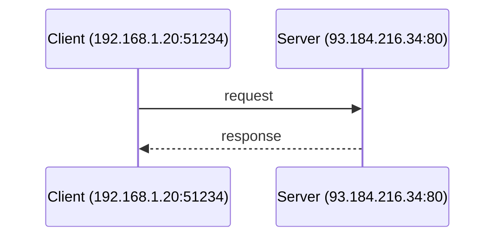
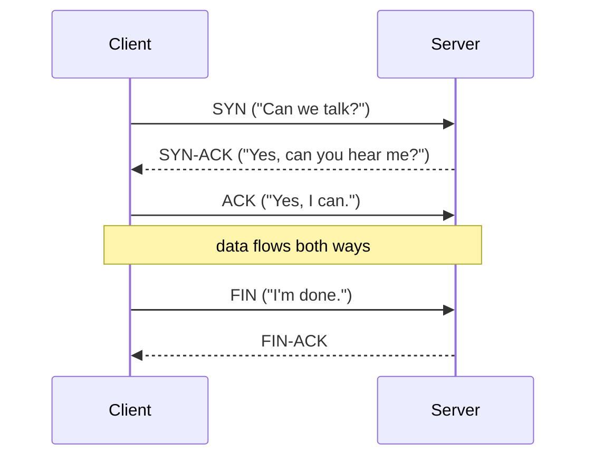

# Sockets Notes

## What is a packet?

A **packet** is a small chunk of data sent across a network. Larger things (a photo, a web page, a video) get chopped into many packets, sent independently, and reassembled by the receiver.

Every packet has a **header** (source/destination address and port, protocol, sequence number, checksum) and a **payload** (the actual data chunk).

A 3 MB photo might split into ~2,000 packets of ~1,500 bytes each, numbered so the receiver can reorder and rebuild them.

## Review: private IP addresses and ports, with `ping` and `nmap`

- Every computer has an **IP address** (like a street address).
- Every **port** is a numbered door on that address; different protocols/services listen on different ports.

| Port | Common use |
| --- | --- |
| 22 | SSH |
| 25 | SMTP (email) |
| 53 | DNS |
| 80 | HTTP |
| 443 | HTTPS |

**`ping`** says hi: sends a small ICMP packet and waits for a reply, confirming the machine is reachable and how long the round trip took.


**`nmap`** shows which ports are open on a machine.


<details>
<summary>If you have a partner, try this exercise with Wireshark</summary>

**Partner A**
1. Find your private IP with `hostname -I`. It should be in the form `192.168.100.*`. Make sure you are on the CS wifi!
2. Open Wireshark and click on the fin the top left corner to start a packet capture.


3. Type `icmp` into the filder bar and wait for the pings to start coming through.


**Partner B**
1. Open the terminal and use `ping` on Partner A's IP address.

</details>


## The layered model 


Sending data moves down this stack; receiving moves up it. Each layer wraps the layer above's data in its own header (encapsulation), like nested envelopes.

| Layer | Job | Examples |
| --- | --- | --- |
| Application | What the program actually says | HTTP, DNS, SSH, SMTP |
| Transport | Delivers data to the right *program* (port) | TCP, UDP |
| Internet | Delivers packets to the right *computer* (IP) | IP, ICMP |
| Link | Moves bits across one physical hop | Ethernet, Wi-Fi |


## Public IP addresses and how a browser gets a website

Private IPs (`192.168.x.x`, `10.x.x.x`) only work inside a local network; a router/firewall shares one public IP with everything behind it.




## The internet infrastructure

The backbone is a huge set of high-capacity (often undersea, fiber-optic) cables connecting core routers around the world. Your ISP connects you to this backbone. Even "wireless" only covers the last few meters; everything is cabled underneath.

## Circuit switching vs. packet switching

| | Circuit switching | Packet switching |
| --- | --- | --- |
| Idea | Reserve one dedicated path for the whole conversation | Chop data into packets; each finds its own way |
| Example | Old landline phone calls | The internet |
| Pros | Consistent quality | Efficient, resilient, shares links |
| Cons | Wastes capacity when idle | Packets can arrive out of order or get lost |

If you're in a different country from the server, your packets may take different routes and arrive out of order and your computer reassembles them on arrival.

## Routing and routing algorithms

Routing is deciding which path a packet takes; each router only knows the best next hop. This is a **graph problem**: routers are nodes, links are edges, and costs (distance, delay, congestion) are weights.



Shortest path A to D: A→C→D = 2+1 = **3** (cheaper than the direct A→D edge at 7, or A→B→D at 7).

Well-known algorithms: **Dijkstra's algorithm** (shortest path from one node to all others; used in link-state protocols like OSPF), **Bellman-Ford** (distributed calculation; basis of distance-vector protocols like RIP), and **BGP** (how large networks/ISPs exchange routes across the internet).

## The client/server model

A **client** (you) sends a request to a **server** (a website) and the server sends something back.



A **socket** is one endpoint of that conversation: an IP address + port pair. A connection is defined by two sockets, one on each side.

## UDP (User Datagram Protocol)

UDP communication is "connectionless". You just send the message, no setup, no guarantee it arrives, arrives in order, or arrives only once. Fast and lightweight; good for live video/voice, gaming, DNS lookups.

**Metaphor: walkie-talkie.** Press the button and talk. You don't know for sure anyone heard you.

## TCP (Transmission Control Protocol)

Instead TCP is "connection-oriented". There is a **3-way handshake** sets up the connection first, then data flows reliably (lost packets resent, order preserved), then the connection is torn down.



**Metaphor: phone call.** You dial, they answer, you confirm, then talk. Either side can tell if the other is still there.

| | TCP | UDP |
| --- | --- | --- |
| Connection | Yes (handshake) | No |
| Reliable / ordered | Yes | No |
| Speed | Slower | Faster |
| Metaphor | Phone call | Walkie-talkie |
| Used by | HTTP, SSH, email | DNS, streaming, games |

## Talking with netcat 

`netcat` (`nc`) reads/writes over network connections from the command line. 

**For this walkthrough, you will need a partner**

One partner listens (server), the other sends (client). 
1. Find the listener's IP first.

2. In the terminal, use the following commands to send a message over UDP.

```text
# Listener
nc -u -l <PORT>

# Sender
nc -u <IP ADDRESS> <PORT>
hello over UDP!
```
3. The sender gets no confirmation the message arrived. Close the listener and send again, and the sender won't complain.

4. Now we will send a message with TCP
```text
# Listener
nc -l <PORT>

# Sender
nc <IP ADDRESS> <PORT>
hello over TCP!
```
5. Notice in this example either side can type back. Close the listener while the sender is connected and the sender's `nc` exits or errors, because the TCP connection was torn down.

> Some `nc` versions need `-p` for the listening port: `nc -l -p <PORT>`.

Capture the TCP example in Wireshark (`tcp.port == <PORT>`) to see the SYN / SYN-ACK / ACK handshake before the data; the UDP example (`udp.port == <PORT>`) shows only data packets, no handshake.
